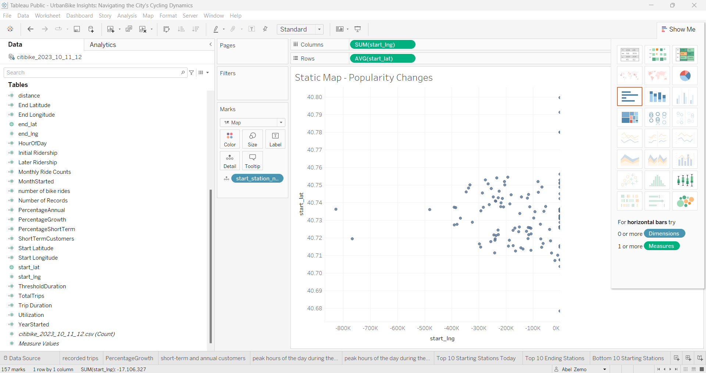
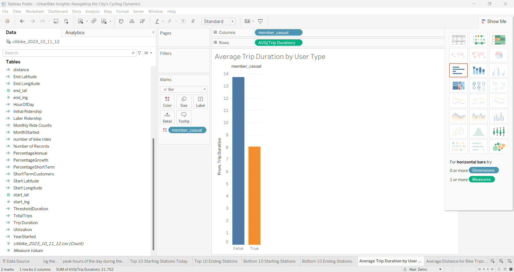
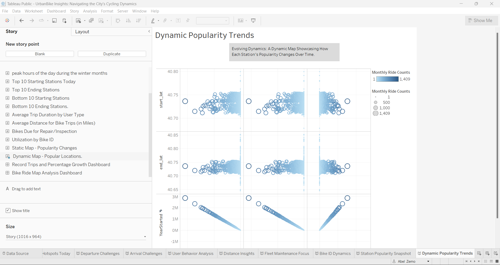
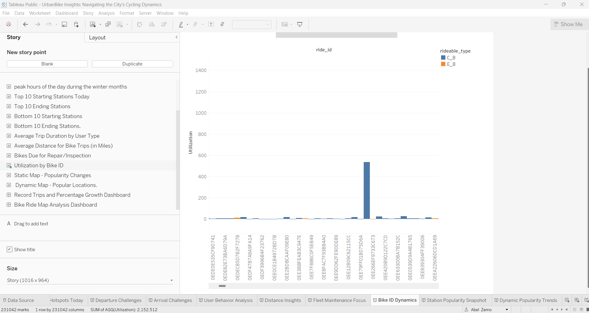
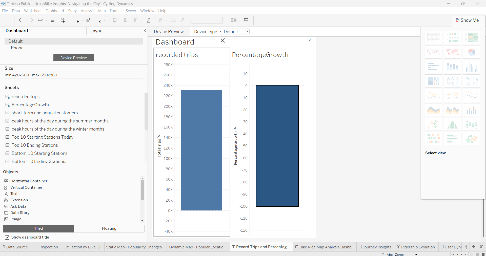

# Challenge 18 - Tableau

[Link to Tableau Viz](https://public.tableau.com/views/UrbanBikeInsightsNavigatingtheCitysCyclingDynamics_17067096292050/UtilizationbyBikeID?:language=en-US&:display_count=n&:origin=viz_share_link)

## Data
The dataset is compiled from three files: JC-202310-citibike-tripdata.csv.zip, JC-202311-citibike-tripdata.csv.zip, and JC-202312-citibike-tripdata.csv.zip, obtained from the New York CitiBike data website. It encompasses various attributes, including Ride ID, Rideable type, Start and End times, Start and End station details (name and ID), and user information specifying whether the ride was taken by a member or a casual user.

In the "data.ipynb" file, I consolidated the three CSV files to overcome Tableau's 1 GB size limit.

To reduce the data and achieve a smaller file size, I took the following actions:

Converted the "member_casual" column to True/False instead of strings.

Mapped the values of the "rideable_type" column to single characters rather than full strings:

"classic_bike" -> "C_B"
"electric_bike" -> "E_B"
"docked_bike" -> "D_B"

## Tableau
The unified CSV file was imported into Tableau, resulting in the creation of visualizations exploring various phenomena. Due to the restricted data size, an in-depth examination of long-term trends over seasons or years was not feasible.

## NOTE
Tableau on the web does not seem to adhere to fixed-size Story and Dashboards.

Link to Tableau Visualization

sample Images:

## Analysis

### Overview:
This Tableau-based bike-sharing system analysis provides a comprehensive exploration of key metrics and trends, offering valuable insights for city officials and stakeholders. The analysis covers a range of topics, from overall ridership growth to user behavior, station popularity, and fleet health.

### Key Questions Explored:
#### Total Recorded Trips:

Insight: The total recorded trips provide a foundational understanding of the bike-sharing system's usage during the selected period.

#### Percentage Growth in Ridership:

Insight: Percentage growth in ridership helps assess the system's success and adaptability, providing a holistic view of its evolution.

#### Changes in User Proportions:

Insight: Understanding shifts in user proportions aids in tailoring marketing strategies and incentives to attract and retain both short-term customers and annual subscribers.

#### Peak Hours in Summer and Winter:

Insight: Identifying peak hours during different seasons assists in optimizing resource allocation and promoting bike-sharing during specific time frames.

#### Top and Bottom Stations Today:

Insight: Analysis of the top and bottom starting and ending stations offers real-time insights into high-traffic areas and areas requiring targeted improvement.

#### Average Trip Duration and Distance:

Insight: Examining average trip duration by user type and average distance provides a nuanced understanding of user behavior and journey lengths.

#### Fleet Health Check:

Insight: Identifying bikes due for repair or inspection and assessing utilization variability by bike ID contributes to proactive fleet maintenance.

#### Static and Dynamic Maps:

Insight: Visualization through static and dynamic maps offers a spatial and temporal understanding of station popularity, aiding in infrastructure optimization.

#### How to Use:
Navigate through each Tableau sheet to explore detailed visualizations and gain insights into specific aspects of the bike-sharing system.
For a cohesive overview, explore the provided stories, each focused on answering specific questions and presenting actionable insights.
Use the captions to understand the context of each visualization and gain a quick overview of the key findings.

### Potential Future Analysis
Incorporate weather data to explore the impact of temperature and precipitation on usage.
Utilize age and gender data (if available) to identify additional trends.
Expand the dataset over multiple years to analyze rider growth and yearly trends.
Leverage membership data to determine the average individual member's CitiBike usage.